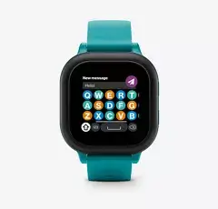
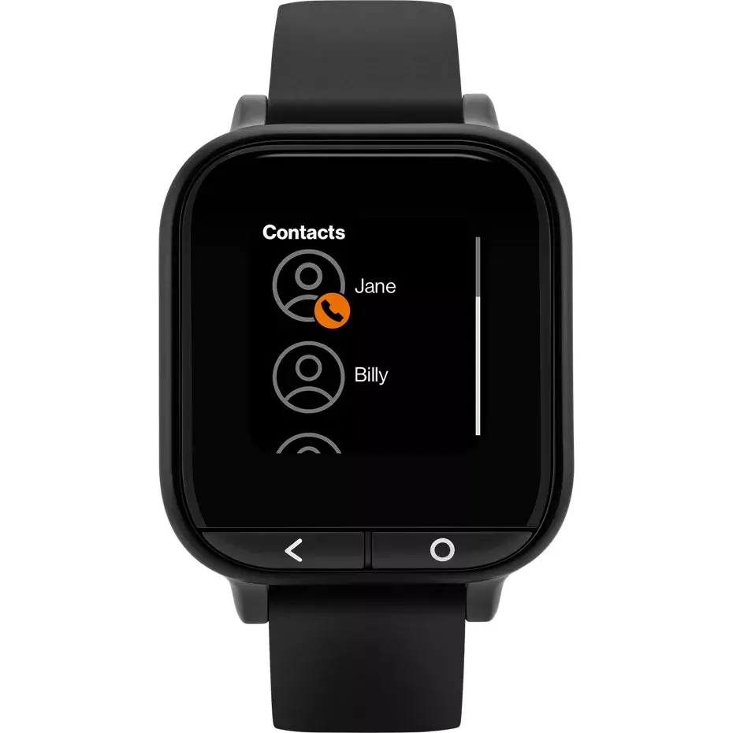
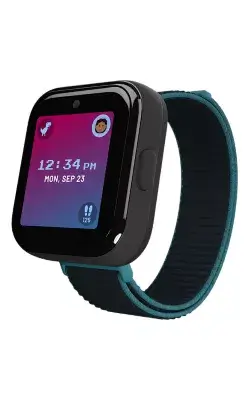
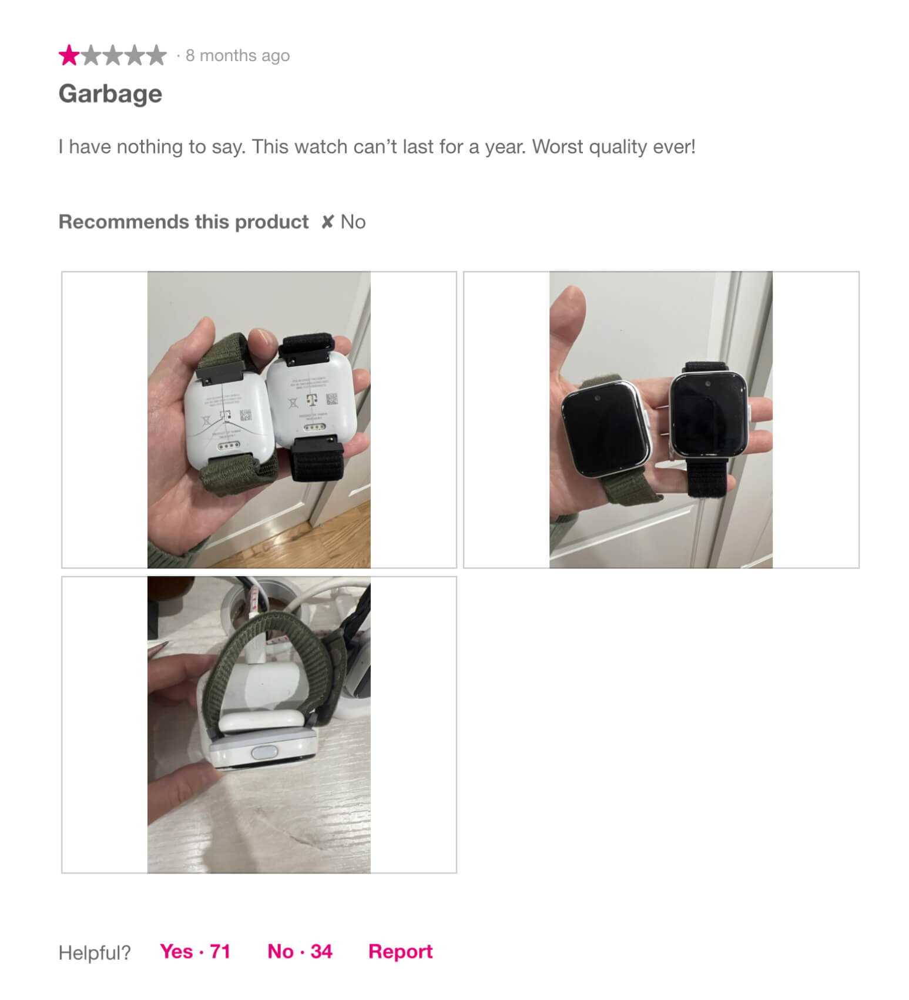

This morning I decided to log in to my Verizon account to look for ways to, uh, ultimately increase my bill. In doing so I saw that Verizon sold a Disney watch for kids. My first reaction was "lol, what." Then I became obsessed with the reviews for a Verizon product on a Verizon website. Obviously these reviews go through some sort of censorship right? But they are so bad!

They uploaded the world's smallest product pictures, but we can see that the keyboard on this thing is just the left side of a keyboard.

These devices remind me of the touch screen phones Verizon released in the wake of the original iPhone. Verizon hasn't learned much about hardware design or the effects of ewaste on the environment. These devices apparently have a very short lifespan and break often, despite being geared towards kids.

The Verizon Care "smart watch" is interesting because all the reviews talk about being misled on if this device has fall detection (it does not) but ultimately seems like it's geared to be a modern Life Alert-like device.

I went to see if The Wirecutter has reviewed these and found that they call the one for kids "The Best Smartwatches for Kids" -- the other one they recommend is an Apple Watch SE, which does cost $100 more. The promotion of this Verizon smart watch for kids is pretty bad and not a great look for The Wirecutter.

Whenever I find a good Wikipedia page I always read the "Talk" tab to see the Wikipedia editor drama behind the article I just read. The equivalent of this on The Wirecutter is the "Other products we tested" section.

This brings us to the brick on a bracelet known as the T-Mobile smart watch for kids. T-Mobile, like Verizon, also has reviews. They're all bad. The device becomes ewaste in no time too. That's not the interesting part. The best part of the T-Mobile reviews is that you can post photos!

And once again we HAVE to assume T-Mobile is heavily moderating these. Which is all the more puzzling that this review is available for us to see. I'm glad it does because it's horrifying! Like, at what point do you pull or recall a product? Your own website tells me that kids are being burned by your bad product that you didn't really extend any effort on nor care about.

Even more damning was the review under it showing that the lithium ion batteries on multiple watches are expanding and cracking the plastic that is tightly strapped to a child's wrist.

Last night I was watching a [Little Joel video about smartphone drama](https://youtu.be/UD6BO4-lkEo?si=JlPlp62_kNXVU5UR) where the disgraced Linus Tech Tips reviews a new phone and says it's on par with 10 year old smartphones. Our Joel comes to the absolutely correct conclusion: if the new phone is the same thing as a 10 year old phone, why not save the environment the trouble and just buy the already-produced old phone. Why should we waste materials on buying new ewaste when there's perfectly fine ewaste already available?

So let's save your kid the embarrassment of having some uncool and pointless plastic on their wrist: just go buy a cheap old used Apple Watch. If it needs it, replace the battery. Everything will be fine. Lord knows Apple has produced more of these things than the world needs. Especially with it being apart of their yearly product update cycle despite the Apple Watch ultimately being the same device it was a decade ago when it was first released.
