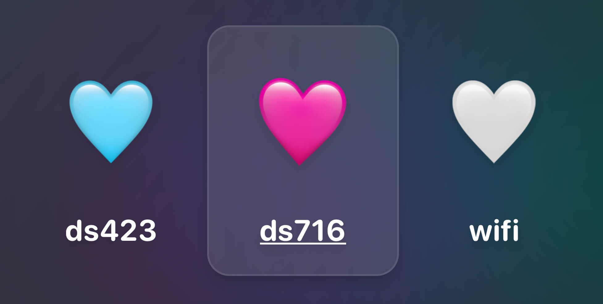
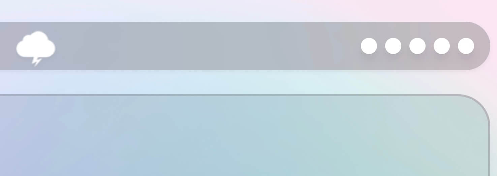
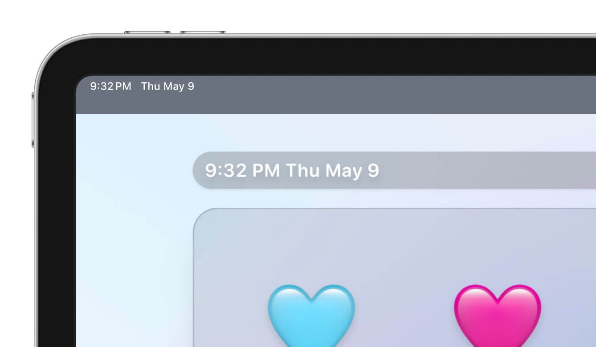

I run a few self-hosted services and I wanted to provide a portal that only people on my network could reach. I use [Tailscale](https://tailscale.com/) and [NextDNS](https://nextdns.io/?from=qa2cg8e9) to accomplish this, but that's probably a post for another time.

The page itself is just a single html file that loads up [TailwindCSS](https://tailwindcss.com/) and is composed of three web components: app-list, status-dots, and current-date-time.

App-list takes an array of JavaScript objects and generates the grid of emoji icon'd apps.



The config for these looks like this:

```javascript
const config = [
  {
    name: "blue",
    href: "https://blue.example.com/",
    icon: "🩵",
  },
  {
    name: "pink",
    href: "https://pink.example.com/",
    icon: "🩷",
  },
  {
    name: "white",
    href: "https://white.example.com",
    icon: "🤍",
  },
]
```

Status-dots might be less apparent what it's doing, but if you look at the menu bar in the top right you see five white dots. These are made out of [Uptime Kuma's status badges](https://github.com/louislam/uptime-kuma/wiki/Badge). Basically, if Uptime Kuma detects an outage the badge color will change from white to red. It doesn't auto-refresh but maybe it should!



Their config looks like this and is made up of the Uptime Kuma monitor ID and a name

```javascript
const statuses = [
  {
    id: 1,
    name: "intranet",
  },
  {
    id: 2,
    name: "external",
  },
]
```

And the final web component that this is made up of is current-date-time. This is just cosmetic to match the aesthetic, but it is functional.



I took some advice I was reading about what makes a good web component: sometime simple that compliments already present elements, so it is used like this:
    
```html
<current-date-time>
  <time></time>
</current-date-time>
```

The web component takes the time element and fills it out appropriately the way you are supposed to use the [time element](https://developer.mozilla.org/en-US/docs/Web/HTML/Element/time).
    
```html
<current-date-time>
  <time datetime="2024-05-10T04:49:38.994Z">
    9:49 PM Thu May 9
  </time>
</current-date-time>
```

I don't think this is perfect yet, but it's been fun to build something where all the JavaScript comes from web components.
