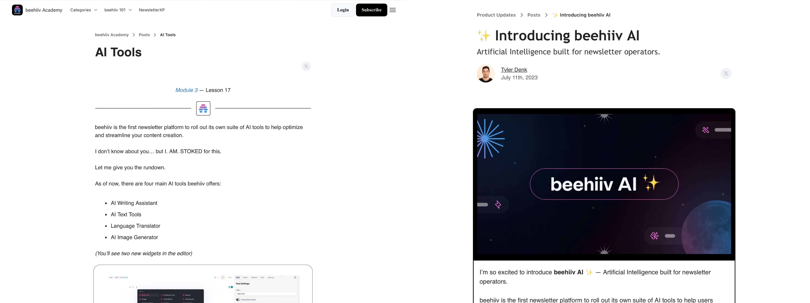
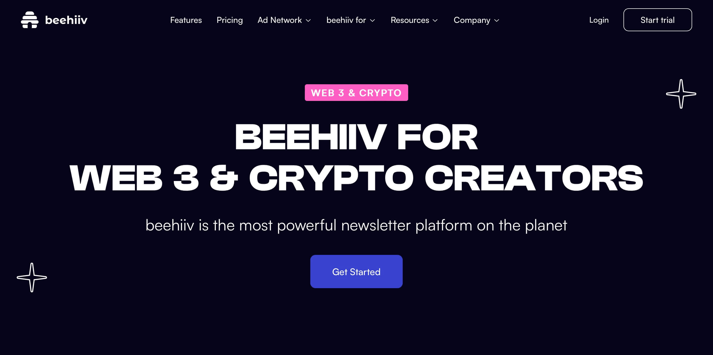
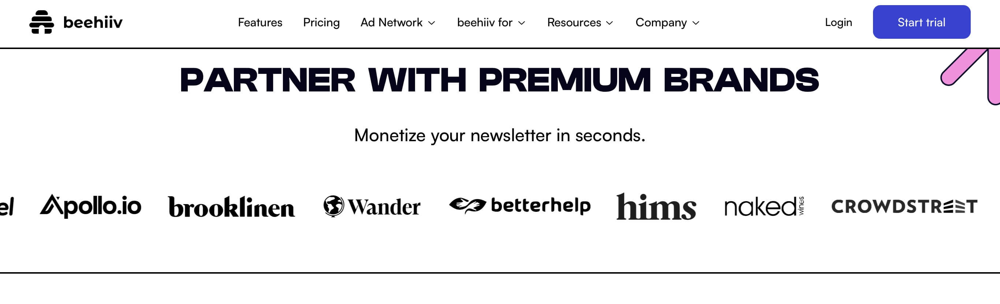

Last year when Jonathan M. Katz dropped his bombshell piece about the [Substack's nazi problem](https://www.theatlantic.com/ideas/archive/2023/11/substack-extremism-nazi-white-supremacy-newsletters/676156/) he wasn't saying anything trans people didn't already know. As one since-paywalled post said, "trans people are always the canaries in the coal mine." Substack has always courted this kind of bigoted content, but unfortunately the rights of queer people take a back seat and we have to rely on cis allies to voice the same opinions before it gets taken seriously. (Credit to [Luke O'Neil](https://www.welcometohellworld.com) and [Seth Simons](https://www.humorism.xyz) who ditched Substack early on over trans rights.) This finally lead to a large amount of people leaving Substack. Oddly enough, some doubled down, some tried to argue that a few nazis is fine actually, and others started new Substacks! C'mon, grow up. How desperate must you be to willingly go to the [nazi bar](https://en.wiktionary.org/wiki/Nazi_bar) to beg for money?

At the beginning of the year, people left Substack for places like Buttondown, Ghost, and Beehiiv in droves. Two of [my favorite newsletters](https://melkat.blog/p/my-favorite-newsletters) went to Beehiiv. Both well meaning trans-respecting individuals. Both have reported an increase in paid subscribers since leaving Substack. Last night I decided to take a peak in to what Beehiiv is and what they offer. What I learned was, to put it lightly, not great.

The front page of their site boasts that you can talk to their "Chatbot Assistant." You can easily get it to lie and make up fake features. That's just what they have on the surface. If you dig a little deeper in their "beehive academy" you can see that they will also let you have AI write your newsletter for you or generate images out of copyrighted works.

They prefaced this with a bold and absurd thing to say about yourself:

> beehiv is the first newsletter platform to roll out its own suite of Al tools to help optimize and streamline your content creation.
> I don't know about you... but I. AM. STOKED for this.

Who are you? Why are you talking to me like this? I don't know about you… but I. AM. NOT. IMPRESSED. I think people who actually want to support and receive newsletters would prefer to not have plagiarized AI sludge thrown at their face. This is a feature you make to spam people with your brand, not to "grow" your audience.

The next thing that makes me incredibly skeptical of Beehiiv is featured heavily in their navigation bar: "Beehiiv is for Web 3 & Crypto Creators." This takes you to a page where they talk about their dedication to the financial scam industry and all the hustle bros they are partnered with. You guys know the hype on this con died years ago right? The fad now is AI sludge. Where's your "Beehiiv for Bernie Madoff" page? You must have replaced your marketing team with an AI prompt before they got around to implementing that one.

Here's one last thing that is a red flag for people wanting to use Beehiiv: they are a wanna-be ad network. Obviously, ads aren't a viable solution for web content and we can see this by looking at the state of journalism.

So who is excited for this? Oh, none other than the people at BetterHealth, the Uber-for-Therapy Privacy-For-Nobody company that got in trouble with the FTC for selling your mental health details to Facebook.

Beehiiv has established their entire company on fads, scams, and flat out harmful tactics and the only people who stand to lose here are content creators.
